**********************************************************
**Introduction – Simple Integration with Ansible Galaxy**
**********************************************************

.. contents::

Lab Overview
************

Welcome to the Calm Hands-On-Lab - Simple Integration with Ansible Galayxy.
What we’re going to do here is to import a blueprint to showcase an integration
with Ansible Galaxy (pull mode)

**Part 1: Import blueprint from https://github.com/calm-marketplace/NextOnTour2018/blob/master/lab2/Ansible%20Galaxy%20ThomasF.json **
*****************************************

1. Download the blueprint

2. Login to Prism Central with admin user and using the HPOC credentials

3. Click on the Apps tab across the top of Prism

4. Navigate to the Blueprint ( |image2| ) tab

5. Click on **Upload Blueprint **

6. Enter the Blueprint Name to **ansible-galaxy-<<yourName>> **

7. Choose "calm" as your project and click **Upload **

**Part 2: Edit the blueprint**
**************************************

After the import of a blueprint all credentials are missing! This is needed to avoid that credentials will be exposed or captured.

1. Download the private key: https://github.com/calm-marketplace/NextOnTour2018/blob/master/lab2/id_calm_rsa

2. Click on Credentials

|image17|

3. Edit centos credentials and upload the private key which you just downloaded

|image18|

4. Click on **Back **

5. Click on the Service **Ansible Galaxy **

6. Change the VM name to "CentOS_CI_<<yourName>>"

7. Scroll down on the right side and Click on **Image ** and choose "Centos 7 Cloud Image - 1711"

|image19|

8. Scroll down and Click on **NIC ** and choose "training" as the network

9. Save the blueprint

**Part 3: Launching the Blueprint**
***********************************

Now that the blueprint has been created and saved, you can launch it!

Click on the **Launch** button in the top right. This will bring up the
the launch window. Give this instance a unique name
(**ansible-galaxy-\_<<YourName>>\_1**). Note that for every launch you do you will
need to increment this as instance names must be unique.

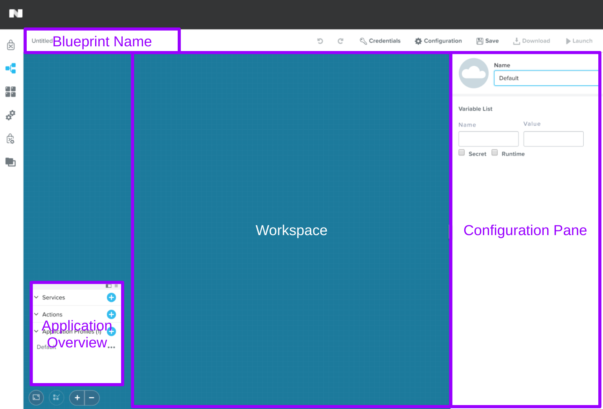
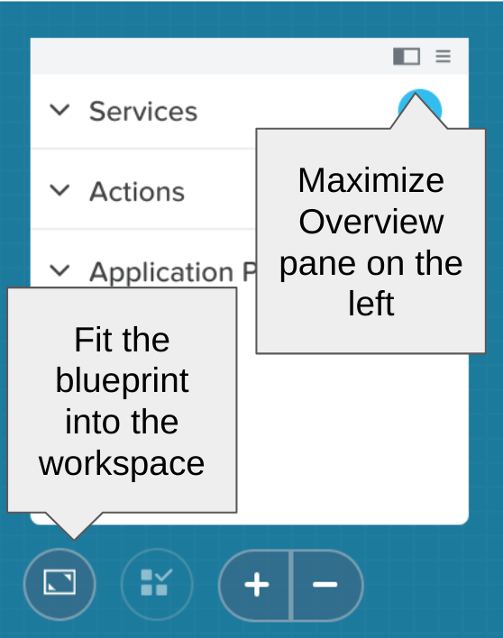

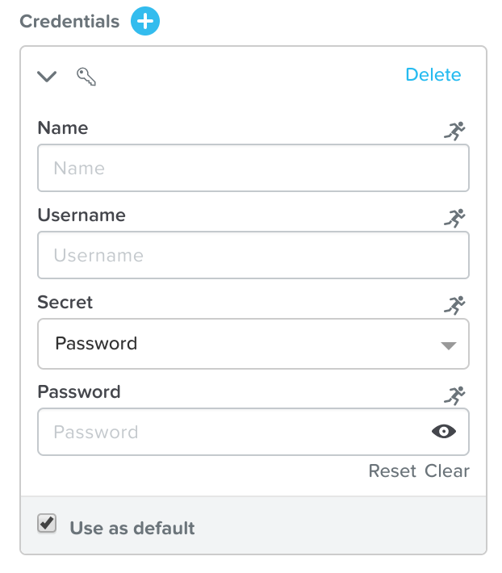
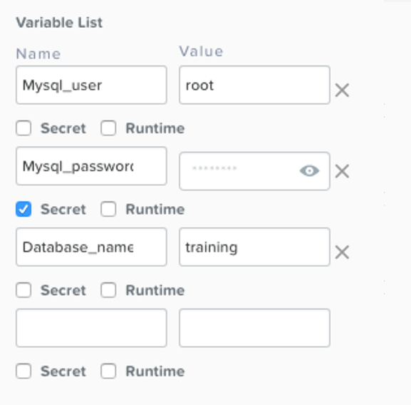
.. |/Users/nathancox/Desktop/Screen Shot 2017-11-29 at 11.54.22 AM.png| image:: ./media/media/image9.png
   :width: 2.99372in
   :height: 3.22371in
.. |/Users/nathancox/Desktop/Screen Shot 2017-11-29 at 12.03.25 PM.png| image:: ./media/media/image10.png
   :width: 3.01458in
   :height: 5.12232in

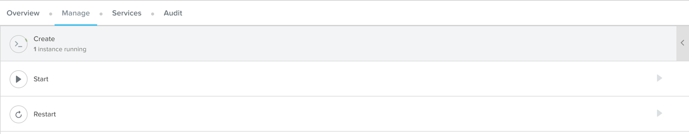
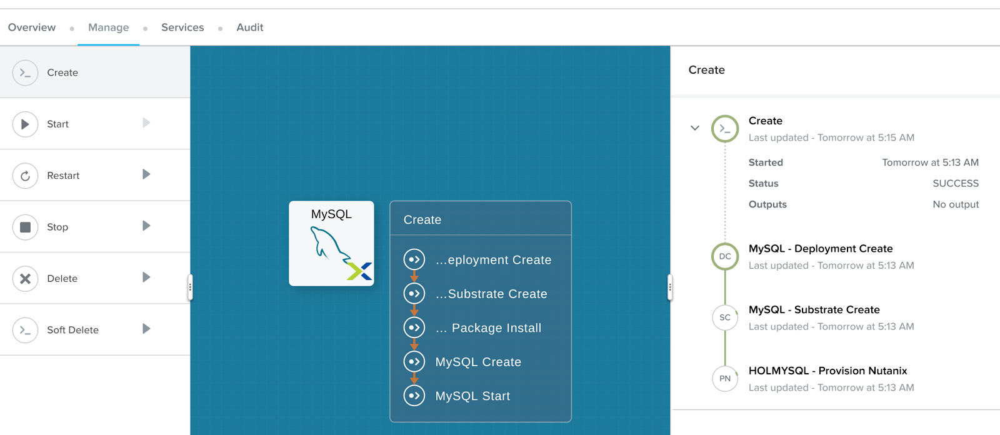
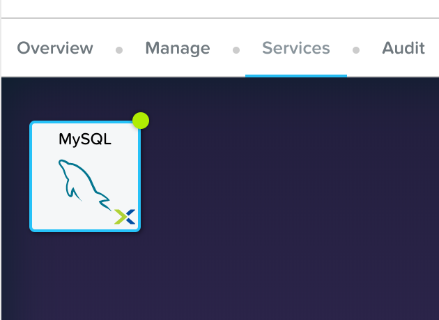
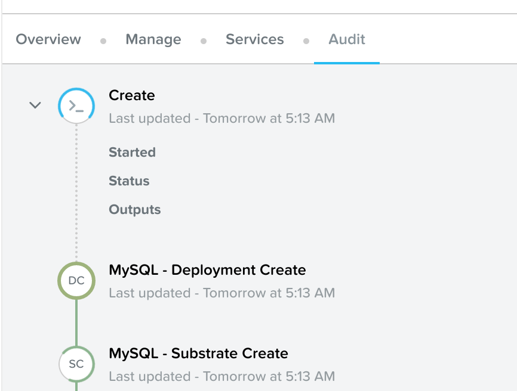
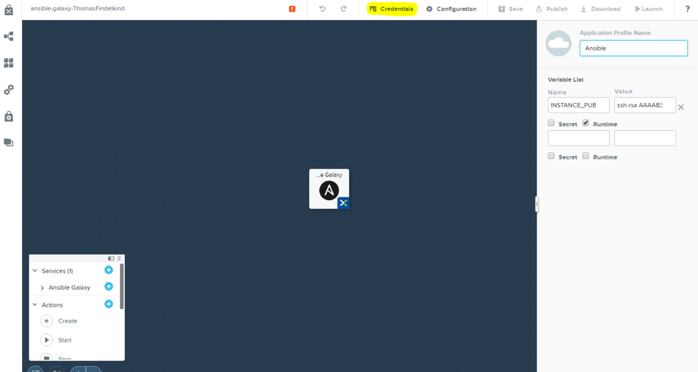
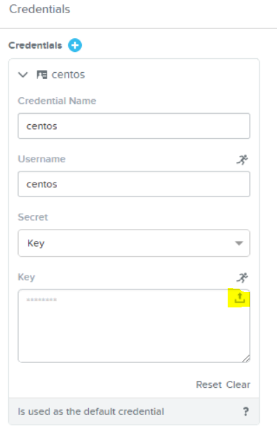
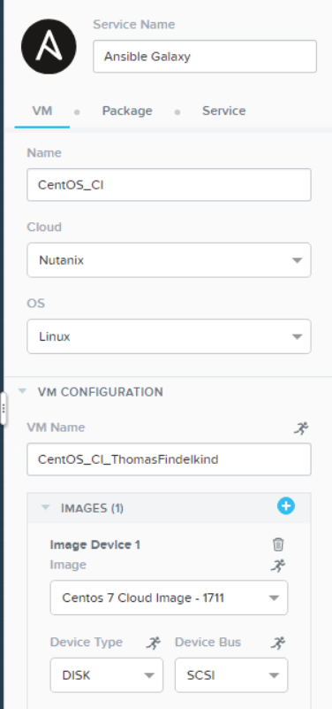
